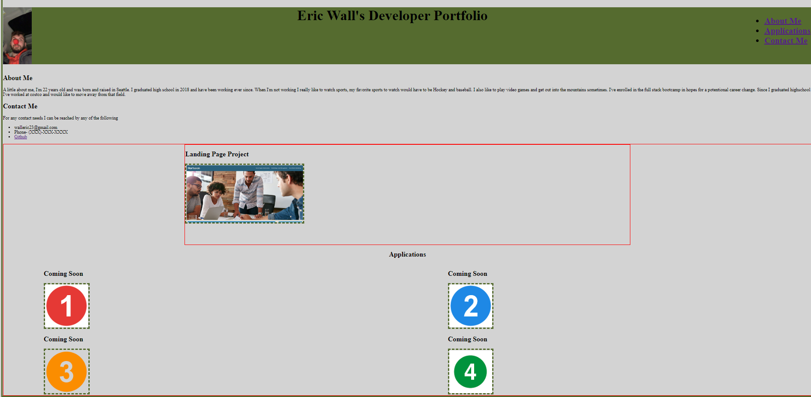

# Portfolio

## Description

The Purpose of this portfolio project was to familiarize myself with the basics of HTML and CSS when it comes to building a website from the ground up. I can also continue to update it throughout the program and beyond with more applications I developed.

## Installation

N/A

## Usage

The usage of this portfolio is for me to display applications I have developed whether it is for looking for a job or just to keep of whatever I have made.

## Credits

N/A

## License

Please refer to the license present in the Github repository.

